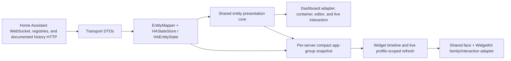

# Dashboard And Widget Presentation Architecture

This document is the implementation map for dashboard cards and the six registered WidgetKit products. Product direction remains in `PRODUCT_ROADMAP.md`; durable decisions are in ADR 4.

## Ownership

### Surface-neutral

- `Shared/EntityPresentation`: entity domain/capability grammar, server-scoped identity, availability, semantic and active state, formatting/precision, presentation eligibility, icon inputs, and exact gauge-zone colors.
- `Shared/FeaturePresentation`: the product catalog relating Control, Status, Sensor, Gauge, and Action across dashboard and widget surfaces, including stable widget kinds and supported families.
- `Shared/Widgets`: compact snapshot models, shared gauge/chart/Sensor Board renderers, single-item face composition, entitlement lock presentation, and deep links.
- `Shared/WidgetInfrastructure`: app-group keys, per-server snapshot envelopes, history request construction, control-action resolution, and standard widget state language.

### Dashboard

- `Homestead/Core/HomeAssistant` owns transport DTOs and official Home Assistant clients.
- `EntityMapper`, `HAStateStore`, and `HAEntityState` own app-facing live state.
- `Homestead/Core/Dashboard` maps live state into shared semantics, resolves the presentation catalog, and adds dashboard-specific feature/control models.
- `Homestead/Features/Dashboard` owns card containers, navigation, interaction, editors, live history consumers, and saved-dashboard persistence.

### WidgetKit

- `Homestead/Core/Widgets` exports profile-scoped credentials/profile metadata and compact per-server snapshots to the app group.
- `HomesteadWidgets/Infrastructure` owns extension-side app-group/keychain access and profile-scoped live Home Assistant refresh.
- Single-item widget files own App Intent schemas, queries, timelines, family adaptation, and interactive buttons.
- `HomesteadWidgets/SensorBoard` owns the native flat configuration declarations for medium and large boards. Both adapt to `HomesteadSensorBoardSlotConfiguration` and use the same batched entry builder.

## Data Flow

## Sharing Contract

| Behavior | Owner |
| --- | --- |
| Entity identity, server scope, availability, semantic/active state, capability grammar, precision, icon semantics, presentation eligibility, chart domain/interpolation, gauge zone colors | One shared source of truth |
| Automatic gauge resolution and widget serialization; semantic presentation and surface layout | Shared model with dashboard/widget adapters |
| Card layout, editor, live interaction, detail navigation, dashboard history consumer | Dashboard only |
| App Intents, entity queries, timeline/snapshot policy, widget families, margins/backgrounds, interactive buttons | Widget only |
| Three/nine-slot composition, selected-slot native configuration, grouped live/history loading, per-slot fallback | Sensor Board specific |

## Configuration Contract

- Control, Status, Sensor, and Action use one primary role-named entity parameter and no automatic first selection.
- Sensor defaults to free `Reading`; chart and gauges are explicit advanced choices.
- Entity identifiers always contain their server UUID. Pickers group first by server and then area/device/type, retain unavailable or removed-server selections for editing, and never route a raw ID to the active server.
- Parameter order is entity, presentation, optional name, then progressively disclosed advanced gauge settings.
- `Automatic`, `Reading`, `Gauge`, and `Chart` use the same terms in widgets and dashboard editing where the concepts overlap.
- Sensor Board's native `Configure Slot` selector is a public-API compromise: only one slot and the parameters relevant to its selected presentation appear at a time. General Sensor and numeric Chart entity parameters are separate internally because App Intent queries cannot depend on another parameter, but both are labeled Sensor in the visible selected-slot form.
- Entitlement checks affect rendering and execution, never stored configuration.

## Compatibility

`HomesteadControlWidget`, `HomesteadStatusWidget`, `HomesteadSensorChartWidget`, `HomesteadSensorBoardWidget`, `HomesteadLargeSensorBoardWidget`, and `HomesteadActionWidget` kind strings are stable. The new per-server snapshot envelope and server-scoped entity identifiers replace beta-era unscoped selections; affected widgets must have their entity selected again.

## Verification

Use the focused presentation, capability, snapshot, deep-link, Plus, and Sensor Board tests. Inspect generated `Metadata.appintents/extract.actionsdata` after changing an intent. Use `--preview-screen widgets` and `--preview-screen dashboard-cards`; both galleries render production shared/card components rather than restyled stand-ins. The real system-owned widget edit sheet must still be checked because its layout is not controlled by Homestead.
